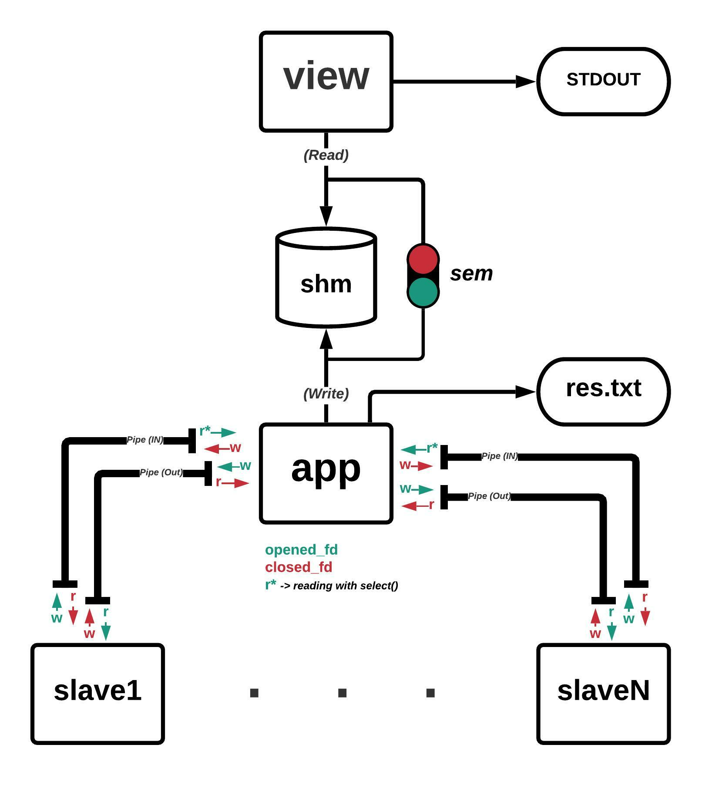

# dsat

A distributed sat solver implemented in c.


### Configure the `.env` file
The `.env` file is used by the `docker/docker.sh` bash script to build the docker image and run the container.

To create the `.env` file, use the template in the `sample_dot_env` file, or rename it to `.env`.

### Build the docker image and run the project container
```console
$ chmod +x ./docker/docker.sh
```

```console
$ cd docker/ && ./docker.sh build && cd ..
```

```console
$ ./docker/docker.sh run
root@e698a84bf24c:/dsat#
``` 

### Build the binary files from the container
```console
root@e698a84bf24c:/dsat# make
rm -rf out/*
gcc -pedantic -std=gnu99 -Wall -fsanitize=address -lrt -pthread -I./src/include -o out/app src/app.c src/utils.c src/shmADT.c src/dispatcherADT.c
gcc -pedantic -std=gnu99 -Wall -fsanitize=address -lrt -pthread -I./src/include -o out/slave src/slave.c src/utils.c
gcc -pedantic -std=gnu99 -Wall -fsanitize=address -lrt -pthread -I./src/include -o out/view src/view.c src/utils.c src/shmADT.c src/dispatcherADT.c
```

### Run the app from the container

#### Mode 1 (with `app` running in background):
```console
root@e698a84bf24c:/dsat# out/app $(DIRECTORIES) &
<info>
root@e698a84bf24c:/dsat# out/view <info>
```
where one must input manually the `<info>` provided by the app program.

#### Mode 2 (using pipes):
```console
root@e698a84bf24c:/dsat# out/app $(DIRECTORIES) | out/view
```
where DIRECTORIES are all the relative paths to the .cnf files.


### Diagram of the inter process communication



### Docs

For more information about the use of the docker container and makefile read [docker](docs/docker.md) and [makefile](docs/makefile.md)